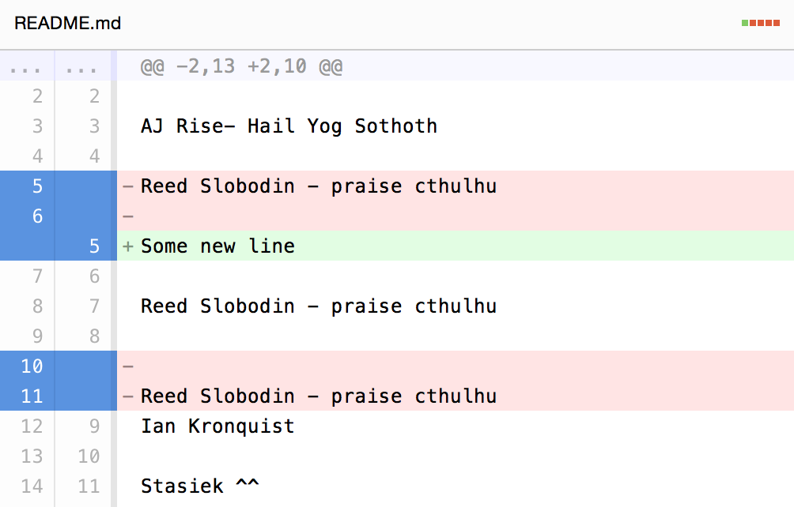
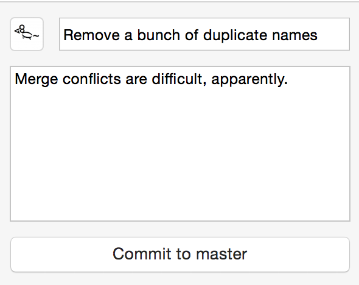

Ian's Guide to GitHub
=====================

Here is a quick tutorial on how to use git. Remember, whenever you have a
problem, Google it!

If you have problems and you can't find an easy fix on Google, email me! My
email is iankronquist@gmail.com

What are these tools?
---------------------

* Git is a tool for managing different versions of files.

* GitHub is a website which stores all the different versions 'in the cloud'
  (on GitHub's computers) so you can all keep an up to date copy of your files
  in one place.

* GitHub Desktop is the desktop application you are using.

* You can see the current state of the repository on [the GitHub website](https://github.com/iankronquist/fellowshipoftherobot).


The simplest way to use GitHub Desktop
--------------------------------------

You don't have to follow this, in fact I encourage some of you advanced users
to explore git and be more adventurous. This is just the path of least
resistance.

1. Make sure there are no changes in the folder! If there are changes you can
   get conflicts, which can be difficult to resolve. Look at the top bar of the
   GitHub program. You should see `No Uncommitted Changes`.
   If there are changes, delete them.

   


2. Before making changes, click the sync button so you have the most up to date
   version of the files.

   

3. Open your files and make your changes in Android Studio or your favorite
   code editing program (Eclipse, NotePad++, vim, etc.). The GitHub app will
   update and show the changes you made. Red lines which begin with a `-` were
   deleted. Green lines which begin with a `+` were added.

   

4. Now you want to commit your changes so git knows about them. Click on the
   `Uncommitted Changes` tab.

   

5. Look on the lower right. Enter a summary, one or two words about the file
   you changed and roughly what you changed. Then enter a description. Tell people
   what you were thinking, what changes you made, and why you made them. If you
   tried something and it didn't work, put that in there too.

   

6. Click the `Commit to master` button.

7. Sync your changes so others can look at them.

   


Resolving merge conflicts
-------------------------

If you follow that recipe religiously, you *probably* won't get any merge
conflicts. However, maybe somebody will push their changes in between when you
sync in step 1 and sync again in step 7. Then your changes and their changes
can be incompatible and this will create a merge conflict.

The GitHub Desktop program will show you that there are merge conflicts. You
will also be able to see them because there will be a bunch of arrows
everywhere and your code won't compile!

Important words:

* `HEAD`: The code sitting on your computer right now.
* `origin/master`: The code on GitHub.

1. Look, you have merge conflicts!

2. Identify where the merge conflicts are. They may not be in one file! They
   will have lots of arrows and the word `HEAD`.

   ```
   ...
   AJ Rise- Hail Yog Sothoth

   >>>>>>>> HEAD
   Reed Slobodin - praise cthulhu
   ========
   Some new line


   <<<<<<<< origin/master

   Reed Slobodin - praise cthulhu

   Ian Kronquist

   ...
   ```

3. Identify what parts of the code have been changed. Look at the differences
   between the code on your computer and on GitHub.

   ```
   This code is the same on GitHub and on your computer

   >>>>>>>> HEAD
   This code is just on your computer

   ========
   This code is just on GitHub

   <<<<<<<< origin/master

   This code is the same on GitHub and on your computer

   ```

4. Fix the merge conflict. Make the file look the way you think it should.

   In the first example, Reed's name was in there twice. Let's delete it and make
   sure our new line is also in the file. In our case, we want to change the file
   to look like this:

   ```
   AJ Rise- Hail Yog Sothoth

   Some new line

   Reed Slobodin - praise cthulhu

   Ian Kronquist

   ```
5. Make sure the changes you made still compile!
   Look over the differences (with the `+`s and the `-`s) one more time, just
   to be sure.

7. Commit the code.

8. Sync the code.

Exploring GitHub and coding
---------------------------

* Learn Java with [MIT Open CourseWare](http://ocw.mit.edu/courses/electrical-engineering-and-computer-science/6-092-introduction-to-programming-in-java-january-iap-2010/)
* Ask questions on [Stack Overflow](https://stackoverflow.com/questions/tagged/java)
* Find [cool projects on GitHub](https://github.com/explore) to play with.
